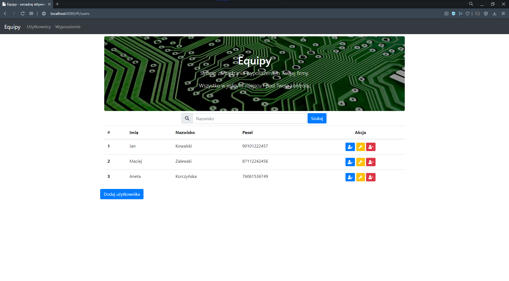
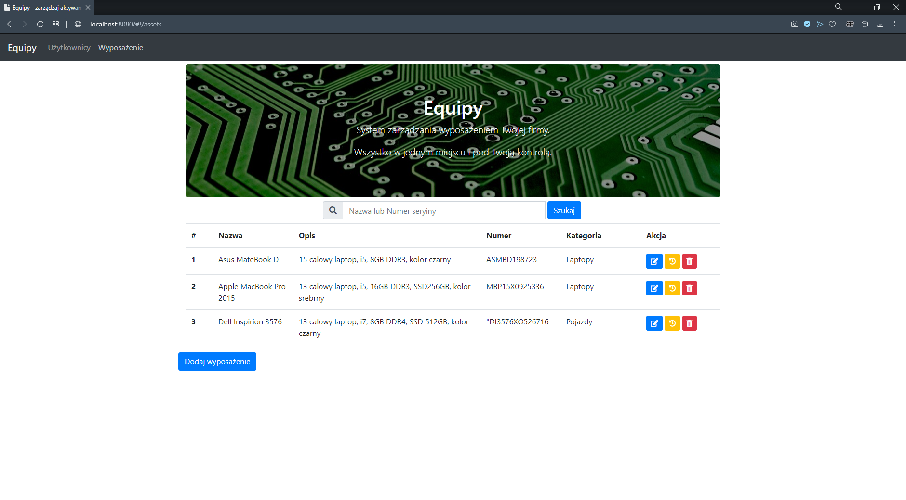

## Spring Boot REST API
The application is web application for managing users. Front-end is in Angular and back-end in Spring Boot.
Back-end communication from front-end by REST API.




## Table of contents
* [Setup](#setup)
* [Technologies](#technologies)
* [Features](#features)
* [Sources](#sources)
* [License](#license)

## Setup

1. Clone or download project from:
```
https://github.com/DawidLachor/SpringBootRestAPI.git
```
2. Add As Maven Project
3. In the terminal go to:
```
/src/main/resources/static
```
4. Execute the command:
```
npm install
```
5. Run the application from EquipyApplication.class

## Technologies

* Java 11
* Spring Boot 2.4.1
* Spring Data
* Spring REST
* Spring/Bean Validation  
* Angular
* H2 Database

## Features

* Search users (by Lastname)
* Add Users
* Edit Users
* List equipment
* Search equipment
* Add equipment

### To Do

* Edit equipment
* Equipment for user
* History loans
* Return equipments for users

## Sources

This application is based on tutorial from [JavaStart](https://javastart.pl)

## License


This program is available on license [Creative Commons Uznanie autorstwa-Użycie niekomercyjne 3.0 Polska](http://creativecommons.org/licenses/by-nc/3.0/pl/).